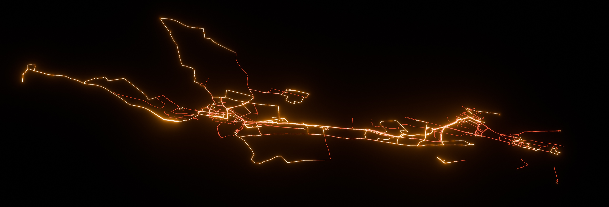

# GPX-Importer
  

A python GPX importer with multi file support for blender.

> [!note]
> 1. This importer has currently been tested with *.GPX files exported from **Apple Health**, **Garmin Connect** and **Zepp**（formerly Amazfit)
> 2. This importer currently just plots latitude and longitude in Degrees as X and Y coordinates.

### How to use the Importer:
Blender 4.0.X is recommended. But I also confirmed that it works with 3.6.2
1. Download the [latest release](https://github.com/zuggamasta/GPX-Importer/releases/tag/v0.1.1-alpha) of this addon from Github
2. Install the gpx_blender.zip file as addon. **(don't unzip it)**
3. Make sure the addon is enabled
4. Import your files via "File > Import > GPS Exchange Format (.gpx)"
5. Each GPX file will be imported in it's own collection. The objects name will be the file name of your original .gpx
> [!tip]
> There are two options available on import, plotting elevation data can be messy so it is not enabled by default.
> - [x] Create Edges
> - [ ] Plot Elevation

Make sure to check the objects location in space after import. Imported meshes might be far of screen.
